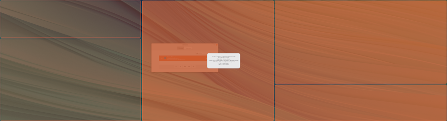
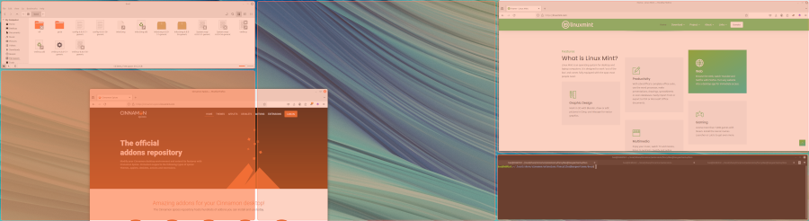

# Fancy Tiles

Fancy Tiles is a [Cinnamon](https://github.com/linuxmint/Cinnamon) Extension that snaps your windows to regions in a very flexible layout. This layout does not have to be a typical grid where horizontal and vertical lines span the screen and columns and rows do not have to be evenly distributed. This is inspired by the way [Fancy Zones](https://learn.microsoft.com/en-us/windows/powertoys/fancyzones) work in Windows.


## Install

Download the code in this repository and place it in the directory `~/.local/share/cinnamon/extensions/fancytiles@basgeertsema` . Or use the one-liner below to download and install directly.

```bash
mkdir ~/.local/share/cinnamon/extensions/fancytiles@basgeertsema && (curl -s -L https://github.com/BasGeertsema/fancytiles/archive/refs/heads/main.tar.gz | tar xvz -C ~/.local/share/cinnamon/extensions/fancytiles@basgeertsema --strip-components=1)
```

Open Cinnamon Extensions, click on the Fancy Tiles extension and click the '+' button to enable Fancy Tiles.


## Quick start

After enabling the extension, press `<SUPER>+G` to open the layout editor. It will start by a 2x2 grid layout. Click and drag the dividers (the lines between regions) to resize the regions. If you want to split a region, press `<SHIFT>` or `<CTRL>` while hovering over the region to split the region horizontally or vertically. Use the `right mouse button` to remove dividers. Use `<Page Up>` and `<Page Down>` to increase or decrease the spacing between the regions.

After you have crafted your desired layout, exit the editor using `<SUPER>+G` or `<ESC>`.



Now, start dragging a window and simultaneously hold the `<CTRL>` key. The layout will become visible. Hover your mose over the region you want the window to snap to and release the mouse button. The window will now be snapped into place.



## Loading and saving presets

There are 8 slots to hold layout presets. Presets 4-8 are read only _system presets_ and 1-4 are your _user presets_. When the layout editor is opened, press `<SPACE>` to view the presets, and click the preset you want to load. Similarly, press the `<ALT>` key to open the save preset dialog and select one of the four user slots that you want to save the current layout to.

Tip: you can quickly load presets by opening the layout editor and immediately press the slot number of your desired preset (1-8).